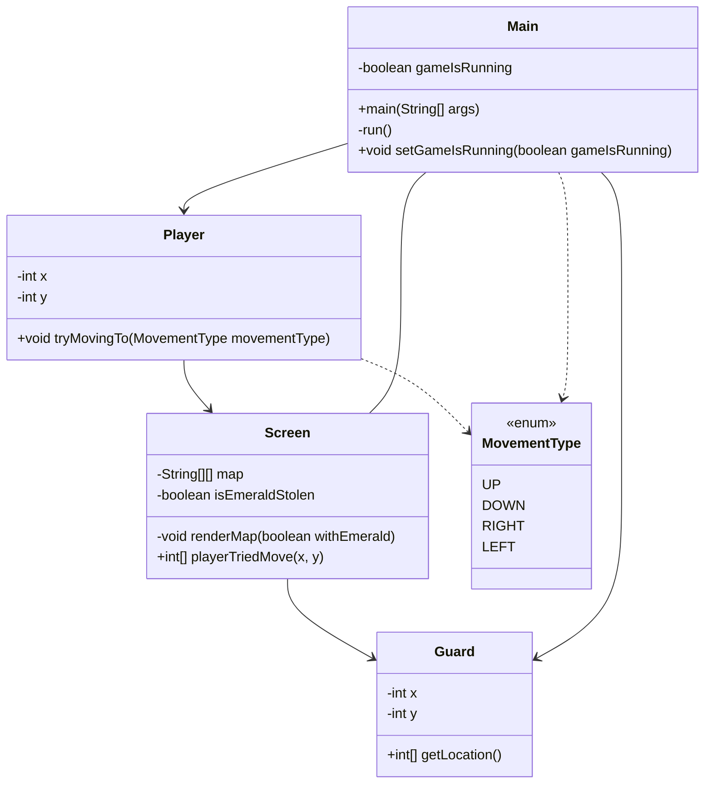

```mermaid
classDiagram
    class Main {
        -boolean gameIsRunning
        
        +main(String[] args)
        -run()
        +void setGameIsRunning(boolean gameIsRunning)
    }
            
    class Screen {
        -String[][] map
        -boolean isEmeraldStolen
        
        -void renderMap(boolean withEmerald)
        +int[] playerTriedMove(x, y)
    }
            
    class Guard {
        -int x
        -int y
        
        +int[] getLocation()
    }
    
    class Player {
        -int x
        -int y
        
        +void tryMovingTo(MovementType movementType)
    }
            
    class MovementType {
        <<enum>>
        
        UP
        DOWN
        RIGHT
        LEFT
    }
    
    Screen-->Guard
    Player-->Screen
    Main-->Guard
    Main-->Player
    Main--Screen
    Player..>MovementType
    Main..>MovementType
```